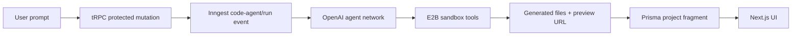

# LaunchKit AI

LaunchKit AI is an open-source AI app builder that turns prompts into runnable web apps with sandboxed coding agents. It combines a chat-first product surface with OpenAI-powered agent workflows, Inngest orchestration, E2B code sandboxes, tRPC APIs, Clerk authentication, Prisma, and Postgres.

The project is designed for maintainers and builders who want a practical reference app for prompt-to-app generation, safe sandbox execution, usage limits, and previewable artifacts.

## Why This Exists

Most AI app builders hide the interesting parts. LaunchKit AI keeps the architecture visible so open-source maintainers can inspect, fork, and adapt the core loop:



## Features

- Sandboxed coding-agent workflow with `@inngest/agent-kit` and E2B.
- OpenAI model calls for code generation, fragment titles, and user-facing responses.
- Next.js App Router, React 19, Tailwind CSS, and shadcn-style UI primitives.
- tRPC routers for projects, messages, and usage state.
- Clerk authentication with protected project routes.
- Prisma schema for projects, messages, fragments, and usage accounting.
- Rate-limited free/pro usage model through `rate-limiter-flexible`.
- CI-ready lint, typecheck, and build scripts.

## Screenshots


See [docs/demo.md](./docs/demo.md) for smoke-test verification and the full provider-backed demo checklist.

## Tech Stack

| Area | Tools |
| --- | --- |
| App | Next.js 15, React 19, TypeScript |
| UI | Tailwind CSS 4, Radix UI, lucide-react |
| API | tRPC, TanStack Query |
| Agents | OpenAI, Inngest Agent Kit |
| Sandboxes | E2B Code Interpreter |
| Auth | Clerk |
| Data | Prisma, Postgres |
| Background jobs | Inngest |

## Quick Start

```bash
git clone https://github.com/AndyY-Q/Sparal-ai.git launchkit-ai
cd launchkit-ai
npm install
cp .env.example .env.local
npm run dev
```

Open [http://localhost:3000](http://localhost:3000).

## Environment Variables

Create `.env.local` from `.env.example`.

| Variable | Required | Purpose |
| --- | --- | --- |
| `DATABASE_URL` | Yes | Postgres connection string used by Prisma. |
| `NEXT_PUBLIC_CLERK_PUBLISHABLE_KEY` | Yes | Public Clerk browser key. CI can use the documented dummy test key for build-only checks. |
| `CLERK_SECRET_KEY` | Yes for auth runtime | Server-side Clerk key. |
| `OPENAI_API_KEY` | Yes for agent runtime | OpenAI key used by `@inngest/agent-kit`. |
| `E2B_API_KEY` | Yes for sandbox runtime | E2B key used to create sandboxes. |
| `INNGEST_EVENT_KEY` | Yes for deployed jobs | Inngest event key. |
| `INNGEST_SIGNING_KEY` | Yes for deployed jobs | Inngest signing key. |
| `NEXT_PUBLIC_APP_URL` | Recommended | Canonical app URL for deployed environments. |

## Provider Setup

### Clerk

1. Create a Clerk application.
2. Copy the publishable and secret keys into `.env.local`.
3. Configure sign-in and sign-up URLs for `/sign-in` and `/sign-up`.

For CI build verification only, this repository uses a non-secret dummy publishable key:

```bash
NEXT_PUBLIC_CLERK_PUBLISHABLE_KEY=pk_test_ZHVtbXkuY2xlcmsuYWNjb3VudHMuZGV2JA
CLERK_SECRET_KEY=sk_test_ZHVtbXk
```

These values are intentionally not valid for real runtime authentication.
When these exact dummy values are present, LaunchKit AI enters smoke-test mode: Clerk middleware, ClerkJS, the pricing table, and authenticated project lists are skipped so CI can verify the public app shell without contacting Clerk.

### OpenAI

Create an API key and set `OPENAI_API_KEY`. The current agent configuration lives in `src/inngest/functions.ts`.

### E2B

Create an E2B account and set `E2B_API_KEY`. The sandbox template is in `sandbox-templates/nextjs`.

### Inngest

Run Inngest locally when testing background jobs:

```bash
npx inngest-cli@latest dev
```

The app exposes the Inngest handler at `/api/inngest`.

### Database

Run migrations after configuring `DATABASE_URL`:

```bash
npx prisma migrate dev
```

## Development

```bash
npm run dev
npm run lint
npm run typecheck
npm run build
```

The `npm run ci` command runs all three verification steps.

## Repository Visibility Checklist

Before applying to OpenAI Codex for OSS, make sure GitHub can review the project without authentication:

- Set the repository visibility to public.
- Confirm `https://github.com/AndyY-Q/Sparal-ai` loads in a private browser window.
- Confirm the repository appears on the public `AndyY-Q` profile.
- Confirm the GitHub API returns metadata from `https://api.github.com/repos/AndyY-Q/Sparal-ai`.
- Add repository topics such as `openai`, `coding-agent`, `e2b`, `inngest`, `nextjs`, `trpc`, `oss`.
- Add a short repository description: `Open-source AI app builder for turning prompts into runnable web apps with sandboxed coding agents.`

## OSS Application Narrative

LaunchKit AI should be presented as an open-source AI app builder with a transparent sandboxed coding-agent architecture. The strongest application angle is:

> LaunchKit AI gives open-source maintainers and builders a working reference for prompt-to-app generation, isolated code execution, artifact previews, and usage governance using widely adopted web primitives.

## Contributing

Contributions are welcome. Start with issues labeled `good first issue` or `help wanted`, and open a pull request with a clear description, screenshots for UI changes, and the output of:

```bash
npm run ci
```

## Roadmap

See [ROADMAP.md](./ROADMAP.md).

## License

MIT. See [LICENSE](./LICENSE).
