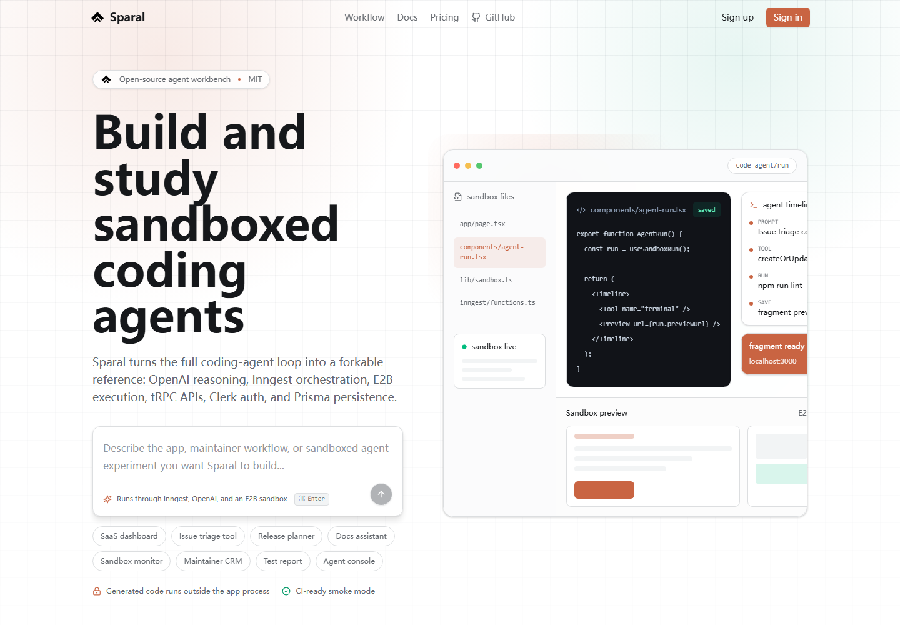

# Sparal Demo

This demo uses smoke-test mode so the public app shell can be reviewed without real provider credentials.

## Public Home



The public screen explains Sparal as a forkable coding-agent workbench and shows the core architecture:

1. Prompt intake
2. Inngest agent run
3. E2B sandbox execution
4. Fragment preview and persistence

## Smoke-Test Mode

Set these values to verify the public shell without contacting Clerk:

```bash
NEXT_PUBLIC_CLERK_PUBLISHABLE_KEY=pk_test_ZHVtbXkuY2xlcmsuYWNjb3VudHMuZGV2JA
CLERK_SECRET_KEY=sk_test_ZHVtbXk
```

Then run:

```bash
npm run ci
npm run start
```

Smoke-test mode intentionally skips ClerkJS, Clerk middleware enforcement, the hosted pricing table, and authenticated project lists. Real provider keys are still required for end-to-end agent generation.

## Full Provider Demo Checklist

Use this checklist when recording a real demo with provider credentials:

- Create a Clerk app and enable sign-in/sign-up.
- Configure `DATABASE_URL` and run `npx prisma migrate dev`.
- Configure `OPENAI_API_KEY`, `E2B_API_KEY`, `INNGEST_EVENT_KEY`, and `INNGEST_SIGNING_KEY`.
- Start the Next.js app and Inngest dev server.
- Create a project from a prompt.
- Confirm the Inngest run creates an E2B sandbox.
- Confirm the assistant message stores a fragment with generated files and a preview URL.
